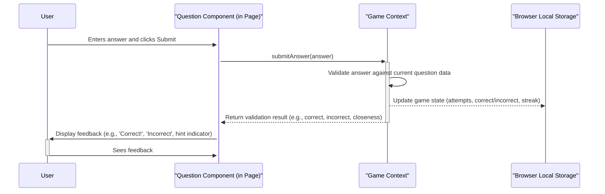

# Daily Critical Thinker

## 1. Project Overview

Daily Critical Thinker is a web-based application designed to enhance critical thinking skills through engaging daily challenges. Users are presented with a variety of puzzles and questions, testing different aspects of logical reasoning and problem-solving. The application tracks user progress, provides feedback, and encourages consistent practice.

**Key Features:**

- **Daily Challenges:** A new critical thinking puzzle or question available each day.
- **Varied Question Types:** Includes both numerical and text-based challenges to test diverse skills.
- **Hint System:** Provides optional hints to assist users when they are stuck.
- **Answer Feedback:** Offers feedback on submitted answers, including closeness indicators for numerical questions.
- **Streak Tracking:** Monitors consecutive days of participation to motivate users.
- **Progress Persistence:** Uses local storage to save game state and user progress locally in the browser.
- **Sharable Results:** Allows users to share their performance with others.

## 2. Architecture & Visual Diagrams

The application follows a client-side architecture built with React and Vite. Core logic and state management are handled within the React components and contexts, utilizing React Query for managing asynchronous operations (if any server interaction were added) and local storage for persisting game state directly in the user's browser. Routing is managed by React Router. UI components are built using Shadcn UI on top of Tailwind CSS.

**Architecture Diagram:**

```mermaid
graph TD
    subgraph Browser
        LocalStorage[("Local Storage (Game State, Streaks)")]
    end

    subgraph ReactApp "React Application (Vite Build)"
        Router(React Router) --> Page[Current Page Component]

        Page -- Renders --> Components[Reusable UI Components (Shadcn/Custom)]
        Page -- Uses --> Hooks[Custom Hooks (e.g., useGameState)]
        Page -- Accesses/Updates --> Contexts[Global Contexts (e.g., GameContext)]

        Components -- Accesses/Updates --> Contexts
        Hooks -- Reads/Writes --> Contexts
        Contexts -- Persists/Loads --> LocalStorage

        Components -- Use --> LibUtils[lib/utils]
        Hooks -- Use --> LibUtils
        Contexts -- Uses --> Data[data/questions.ts]
    end

    User[User Interaction] --> Page
    User --> Components

    style LocalStorage fill:#f9f,stroke:#333,stroke-width:2px
```

**Data Flow Diagram (Example: Answering a Question):**



## 3. Codebase Structure

The project codebase is organized into the following main directories and files within the `src` folder:

```
src/
├── App.tsx               # Main application component, sets up routing and global layout
├── main.tsx              # Entry point of the application, renders the root component
├── index.css             # Global styles and Tailwind CSS base configuration
├── vite-env.d.ts         # TypeScript definitions for Vite environment variables
│
├── components/           # Reusable UI components used across different pages
│   └── ui/               # Shadcn UI components (often auto-generated/managed)
│   └── ...               # Custom application-specific components
│
├── contexts/             # React Context API for global state management (e.g., game state, theme)
│   └── GameContext.tsx   # Example: Context for managing game logic, questions, answers, streaks
│
├── data/                 # Static data used by the application
│   └── questions.ts      # Contains the list of daily questions and their details
│
├── hooks/                # Custom React Hooks for reusable logic
│   └── useGameState.ts   # Example: Hook encapsulating game state logic interaction
│
├── lib/                  # Utility functions and helper modules
│   └── utils.ts          # General utility functions (e.g., date formatting, class name merging)
│
├── pages/                # Components representing application pages/views
│   └── HomePage.tsx      # Component for the main game interface
│   └── StatsPage.tsx     # Example: Component displaying user statistics and streaks
│
└── types/                # TypeScript type definitions and interfaces
    └── index.ts          # Aggregated type exports or common types
    └── game.ts           # Types related to game state, questions, answers
```

- **`src/`**: Contains all the application source code.
- **`src/App.tsx`**: The root component that sets up routing and global providers (like Contexts).
- **`src/main.tsx`**: The application's entry point where the React app is mounted to the DOM.
- **`src/index.css`**: Contains global styles, Tailwind directives, and base styling.
- **`src/components/`**: Houses all reusable UI components. Sub-directories like `ui/` are common for component libraries like Shadcn.
- **`src/contexts/`**: Manages global state using React Context. Essential for sharing state like game progress or user settings across the application.
- **`src/data/`**: Stores static data, primarily the questions for the challenges.
- **`src/hooks/`**: Contains custom React Hooks to encapsulate and reuse stateful logic.
- **`src/lib/`**: Includes shared utility functions, helpers, or library configurations (like `cn` from `tailwind-merge`).
- **`src/pages/`**: Defines the main view components for different routes in the application.
- **`src/types/`**: Centralizes TypeScript type definitions for better code maintainability and type safety.

## 4. Installation & Setup

Follow these steps to set up the project locally:

**Prerequisites:**

- Node.js (v18 or higher recommended)
- npm, yarn, or pnpm package manager

**Installation:**

1.  **Clone the repository:**

    ```bash
    # Replace <repository-url> with the actual URL of your private repository
    git clone <repository-url>
    cd daily-critical-thinker
    ```

2.  **Install dependencies:**
    Choose your preferred package manager:

    ```bash
    npm install
    ```

    or

    ```bash
    yarn install
    ```

    or

    ```bash
    pnpm install
    ```

3.  **Run the development server:**
    ```bash
    npm run dev
    ```
    or
    ```bash
    yarn dev
    ```
    or
    ```bash
    pnpm run dev
    ```

The application should now be running locally, typically at `http://localhost:5173` (Vite's default) or the port specified in your Vite configuration.

## 5. Usage Instructions

### Running the Application

Once installed, use the `dev` script (as shown above) to run the application in development mode with hot module reloading.

### Building for Production

To create an optimized production build:

```bash
npm run build
```

or

```bash
yarn build
```

or

```bash
pnpm run build
```

This command bundles the application and outputs the static files to the `dist/` directory.

### Configuration

Currently, the primary configuration involves the questions dataset.

**Adding/Modifying Questions:**

Questions are stored in `src/data/questions.ts`. To add or modify challenges, edit this file. Each question object should adhere to the `Question` type defined likely within `src/types/`.

Example structure (refer to `src/types/` for the exact definition):

```typescript
// Example Text Question
{
  id: 1,
  text: "Analyze this logical fallacy...",
  type: 'text',
  answer: ["Strawman", "Straw man argument"], // Array allows for variations
  day: 1, // Corresponds to the day the question appears
  hint: "Consider how the argument misrepresents the opponent's position.",
  explanation: "A strawman fallacy occurs when..."
}

// Example Numerical Question
{
  id: 2,
  text: "If a train travels at 60 mph...",
  type: 'numerical',
  answer: 120,
  day: 2,
  hint: "Distance = Speed x Time",
  explanation: "The calculation involves..."
}
```

Ensure each question has a unique `id` and `day`.

## 6. Additional Sections

### Testing

**(Placeholder for Testing Instructions)**
_Describe how to run tests (unit, integration, end-to-end) if applicable. Include commands and any necessary setup._
_Example:_
_`npm run test`_
_`npm run test:e2e`_

_Currently, no specific testing setup is described in `package.json`._

### Troubleshooting

- **Dependency Issues:** If you encounter issues after installation, try removing `node_modules` and the lock file (`package-lock.json`, `yarn.lock`, or `pnpm-lock.yaml`) and reinstalling dependencies.
- **Port Conflict:** If the default port (e.g., 5173) is in use, Vite might automatically choose another port. Check the terminal output after running `npm run dev` for the correct URL.
- **Build Errors:** Check the console output for specific error messages. Ensure TypeScript types are correct and dependencies are properly installed.

### Deployment

This is a static web application built with Vite, suitable for deployment on various platforms.

**Example: Deploying to Vercel**

1.  Push your code to a Git repository (GitHub, GitLab, Bitbucket).
2.  Sign up or log in to [Vercel](https://vercel.com/).
3.  Import your Git repository.
4.  Vercel should automatically detect the project as a Vite application.
    - **Framework Preset:** Vite
    - **Build Command:** `npm run build` (or `yarn build`, `pnpm run build`)
    - **Output Directory:** `dist`
5.  Deploy. Vercel will handle the build and deployment process.

**Example: Deploying to Netlify**

1.  Push your code to a Git repository.
2.  Sign up or log in to [Netlify](https://www.netlify.com/).
3.  Connect your Git provider and select your repository.
4.  Configure the build settings:
    - **Build command:** `npm run build` (or `yarn build`, `pnpm run build`)
    - **Publish directory:** `dist`
5.  Deploy site.

## Acknowledgments

- Inspired by daily puzzle games like Wordle.
- UI Components from [Shadcn UI](https://ui.shadcn.com/).
- Built with [React](https://reactjs.org/), [Vite](https://vitejs.dev/), and [Tailwind CSS](https://tailwindcss.com/).
